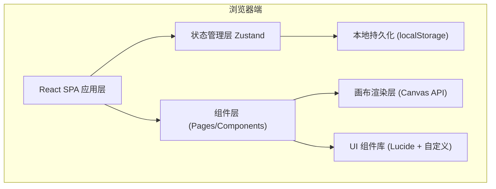
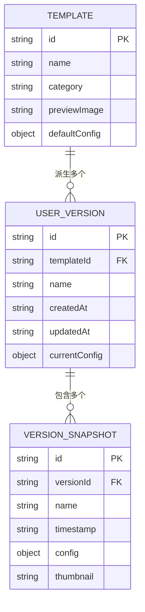

# 短视频封面模板店 - 技术架构文档

## 1. 架构设计

本项目为纯前端应用，数据存储使用浏览器 localStorage，画布渲染使用 HTML5 Canvas API。



## 2. 技术选型

- **前端框架**：React 18 + TypeScript
- **构建工具**：Vite 5
- **样式方案**：Tailwind CSS 3
- **状态管理**：Zustand
- **路由方案**：React Router DOM v6
- **图标库**：Lucide React
- **画布渲染**：HTML5 Canvas 2D API
- **图片处理**：原生 Canvas drawImage + toDataURL
- **数据持久化**：localStorage（自动序列化/反序列化）

## 3. 路由定义

| 路由路径 | 页面组件 | 功能用途 |
|---------|---------|---------|
| `/` | TemplateGallery | 模板广场首页，主题分类 + 模板网格 + 我的作品 |
| `/editor/:templateId` | CoverEditor | 在线编辑器，画布 + 属性面板 + 尺寸切换 |
| `/my-works` | MyWorks | 我的作品管理，版本列表 + 继续编辑入口 |

## 4. 数据模型

### 4.1 数据实体关系



### 4.2 核心数据类型

```typescript
// 模板分类
type Category = 'food' | '探店' | 'knowledge' | 'ecommerce';

// 尺寸类型
type AspectRatio = '16:9' | '9:16' | '1:1';

// 尺寸像素定义
const CANVAS_SIZES: Record<AspectRatio, { width: number; height: number; label: string }> = {
  '16:9': { width: 1920, height: 1080, label: '横版' },
  '9:16': { width: 1080, height: 1920, label: '竖版' },
  '1:1': { width: 1200, height: 1200, label: '方图' },
};

// 文字元素配置
interface TextConfig {
  id: string;
  type: 'title' | 'subtitle';
  content: string;
  fontSize: number;
  fontFamily: string;
  fontWeight: number;
  color: string;
  x: number;
  y: number;
  textAlign: 'left' | 'center' | 'right';
  maxWidth: number;
  lineHeight: number;
}

// 图片元素配置
interface ImageConfig {
  id: string;
  type: 'hero' | 'background';
  src: string | null;
  x: number;
  y: number;
  width: number;
  height: number;
  opacity: number;
  borderRadius: number;
  maskShape?: 'circle' | 'rounded' | 'none';
}

// 模板配置（每个尺寸独立一套布局）
interface TemplateConfig {
  backgroundColor: string;
  backgroundGradient?: string;
  overlayColor?: string;
  texts: TextConfig[];
  images: ImageConfig[];
  decorativeShapes?: Array<{
    type: 'rect' | 'circle' | 'line';
    color: string;
    opacity: number;
    x: number;
    y: number;
    width: number;
    height: number;
  }>;
}

// 完整模板定义
interface Template {
  id: string;
  name: string;
  category: Category;
  tags: string[];
  layouts: Record<AspectRatio, TemplateConfig>;
}

// 用户保存的版本
interface UserVersion {
  id: string;
  templateId: string;
  name: string;
  createdAt: number;
  updatedAt: number;
  currentAspect: AspectRatio;
  layouts: Record<AspectRatio, TemplateConfig>;
  snapshots: VersionSnapshot[];
}

// 快照
interface VersionSnapshot {
  id: string;
  name: string;
  timestamp: number;
  thumbnail: string;
  layouts: Record<AspectRatio, TemplateConfig>;
}
```

## 5. 项目目录结构

```
src/
├── components/
│   ├── gallery/           # 模板广场相关组件
│   │   ├── ThemeNavbar.tsx
│   │   ├── TemplateCard.tsx
│   │   └── MyWorksPanel.tsx
│   ├── editor/            # 编辑器相关组件
│   │   ├── CanvasPreview.tsx
│   │   ├── TextPropertyPanel.tsx
│   │   ├── ImagePropertyPanel.tsx
│   │   ├── AspectSwitcher.tsx
│   │   ├── Toolbar.tsx
│   │   └── VersionManager.tsx
│   └── common/            # 通用组件
│       ├── Button.tsx
│       ├── Modal.tsx
│       └── ColorPicker.tsx
├── pages/
│   ├── TemplateGallery.tsx
│   ├── CoverEditor.tsx
│   └── MyWorks.tsx
├── data/
│   └── templates/         # 模板数据
│       ├── index.ts
│       ├── food.ts
│       ├──探店.ts
│       ├── knowledge.ts
│       └── ecommerce.ts
├── hooks/
│   ├── useCanvasRender.ts  # Canvas 渲染 Hook
│   ├── useVersionHistory.ts # 版本管理 Hook
│   └── useLocalStorage.ts  # 本地存储 Hook
├── store/
│   ├── editorStore.ts     # 编辑器状态
│   └── userStore.ts       # 用户作品状态
├── utils/
│   ├── canvas.ts          # Canvas 工具函数
│   ├── image.ts           # 图片处理工具
│   └── storage.ts         # 存储工具
├── types/
│   └── index.ts           # 全局类型定义
├── router/
│   └── index.tsx          # 路由配置
├── App.tsx
├── main.tsx
└── index.css
```

## 6. Canvas 渲染流程

1. 清空画布并设置尺寸
2. 绘制背景色/渐变
3. 绘制装饰形状（矩形/圆形/线条等）
4. 绘制背景图片（带透明度和混合模式）
5. 绘制遮罩层（可选，用于文字可读性）
6. 绘制人物主图（带圆角裁剪）
7. 遍历绘制文字元素（自动换行 + 描边/阴影效果）
8. 导出 dataURL 作为缩略图或下载
