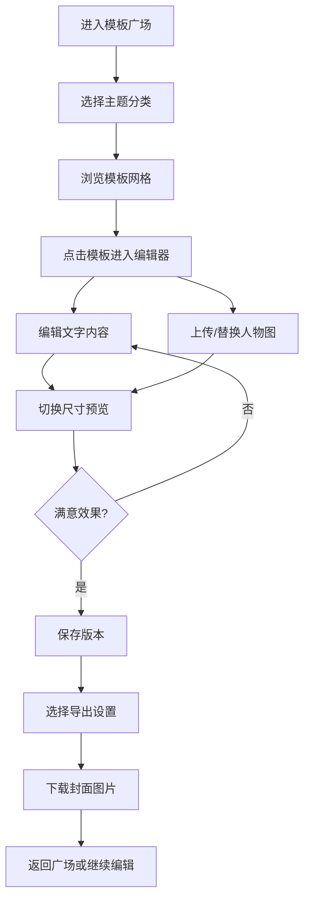

# 短视频封面模板店 - 产品需求文档

## 1. 产品概述

短视频封面模板店是一款面向内容创作者的在线封面设计工具，提供美食、探店、知识、带货四大主题的专业模板，支持在线编辑标题、替换人物图片和一键切换多平台尺寸。

- 核心用户：短视频创作者（美食博主、探店达人、知识UP主、带货主播）
- 核心价值：5分钟产出高质量封面，支持横版/竖版/方图多尺寸一键适配，版本保存便于系列内容创作

## 2. 核心功能

### 2.1 功能模块

1. **模板广场页**：主题分类导航、模板卡片网格、搜索筛选、我的作品入口
2. **在线编辑器**：画布预览、属性面板（标题/副标题/人物图）、尺寸切换栏、操作工具栏
3. **版本管理**：自动保存、手动快照、历史版本列表、版本切换与恢复
4. **导出中心**：多尺寸批量下载、格式选择（PNG/JPG）、质量调节

### 2.2 页面详情

| 页面名称 | 模块名称 | 功能描述 |
|---------|---------|---------|
| 模板广场 | 主题导航栏 | 四大主题切换：美食/探店/知识/带货，高亮当前主题 |
| 模板广场 | 模板网格 | 每个模板卡片展示预览图、名称、标签，点击进入编辑器 |
| 模板广场 | 我的作品 | 展示用户已保存的封面版本缩略图列表 |
| 在线编辑器 | 画布预览区 | 实时渲染当前封面效果，支持缩放查看 |
| 在线编辑器 | 文字编辑面板 | 主标题、副标题输入，字体大小/颜色/位置调节 |
| 在线编辑器 | 图片编辑面板 | 人物图上传、裁剪、透明度调节，支持拖拽 |
| 在线编辑器 | 尺寸切换栏 | 横版(16:9)/竖版(9:16)/方图(1:1)一键切换 |
| 在线编辑器 | 操作工具栏 | 撤销/重做、保存版本、重置、导出按钮 |
| 版本管理面板 | 版本列表 | 展示各版本缩略图、时间戳、版本名称 |
| 版本管理面板 | 版本操作 | 切换版本、重命名、删除、恢复为当前编辑 |
| 导出弹窗 | 导出选项 | 选择尺寸、格式、质量，预览后下载 |

## 3. 核心流程

用户进入模板广场 → 选择主题分类 → 浏览并选择心仪模板 → 进入编辑器替换标题和人物图 → 切换不同尺寸预览效果 → 保存版本（自动+手动）→ 选择导出尺寸和格式 → 下载封面图片。

## 4. 用户界面设计

### 4.1 设计风格

- **主色调**：暖橘渐变 (#FF6B35 → #F7C59F) 作为品牌色，搭配深炭灰 (#2B2D42) 文字色
- **辅助色**：美食主题用辣椒红，探店用城市蓝，知识用智慧紫，带货用金币黄
- **按钮风格**：胶囊圆角按钮，主按钮有渐变填充和悬浮上浮效果
- **字体方案**：标题用「思源黑体 Heavy」加粗显示，正文用「PingFang SC」常规
- **布局风格**：卡片式网格布局，编辑器采用左画布右面板的经典布局
- **图标风格**：统一使用 Lucide 线性图标，搭配主题色点缀

### 4.2 页面设计概览

| 页面名称 | 模块名称 | UI 元素 |
|---------|---------|---------|
| 模板广场 | Hero 区域 | 大标题 + 主题色渐变背景 + 搜索框 CTA |
| 模板广场 | 主题标签栏 | 横向滚动胶囊标签，选中态渐变填充 |
| 模板广场 | 模板卡片 | 悬浮放大 + 阴影加深 + 快速预览按钮 |
| 在线编辑器 | 画布容器 | 深色背景 + 居中画布 + 比例边框提示 |
| 在线编辑器 | 属性面板 | 分组折叠面板 + 实时输入响应 |
| 在线编辑器 | 尺寸切换 | 三段式 Segmented 控件 + 尺寸图标 |
| 版本管理 | 版本卡片 | 时间轴布局 + 缩略图 + 当前版本高亮 |

### 4.3 响应式

- 桌面端（≥1280px）：编辑器采用左右分栏，画布占 65%，面板占 35%
- 平板端（768-1279px）：模板网格由 4 列调整为 3 列
- 移动端（<768px）：编辑器改为上下布局，属性面板改为抽屉式，模板网格 1-2 列
- 触控优化：所有可点击区域 ≥ 44px，手势支持双指缩放画布
